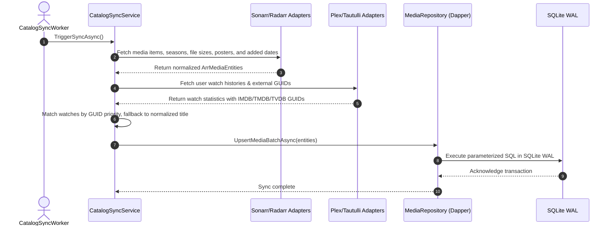

# Curatarr Architecture

> **Archetype**: Controls-Grade Fullstack (.NET 10 + React 19 + TypeScript + Zustand + SQLite WAL + MCP Server First)  
> **Author**: Steven T. Pelech  

---

## 1. High-Level Architecture

```mermaid
flowchart TD
    subgraph Client["Presentation Layer"]
        WebUI["React 19 + TypeScript + Zustand SPA"]
        Agent["MCP AI Agent (SSE Transport)"]
    end

    subgraph Backend["Curatarr Backend (.NET 10 Minimal API)"]
        direction TB
        API["REST Endpoints (/api/v1/*)"]
        MCPServer["MCP Server (/mcp/sse, /mcp/messages)"]
        SyncWorker["Catalog Sync Background Worker"]
        RuleEngine["Smart Category Rule Engine"]
        PruneService["Prune & Safety Execution Service"]
        ConnectionMgr["Dynamic Multi-Instance Manager"]
        
        API --> CoreLogic
        MCPServer --> CoreLogic
        
        subgraph CoreLogic["Domain & Orchestration"]
            RuleEngine
            SyncWorker
            PruneService
            ConnectionMgr
        end

        Repo["Dapper Repositories"]
        SQLite[("curatarr.db (SQLite WAL Mode)")]
        CoreLogic --> Repo
        Repo --- SQLite
    end

    subgraph Instances["Homelab / Selfhost Services"]
        SonarrNodes["Sonarr Nodes (HD, 4K, Anime)"]
        RadarrNodes["Radarr Nodes (HD, 4K)"]
        TautulliNode["Tautulli Server"]
        PlexNode["Plex Media Server"]
        OverseerrNode["Overseerr / Jellyseerr"]
    end

    WebUI -->|HTTP / JSON| API
    Agent -->|SSE / JSON-RPC| MCPServer
    ConnectionMgr -->|HTTP REST APIs (Polly)| Instances
```

---

## 2. Solution Structure

- `src/Curatarr.Core`: Pure domain models, interfaces, DTOs, and smart category specifications.
- `src/Curatarr.Infrastructure`: Typed HTTP adapters (Sonarr, Radarr, Tautulli, Plex, Overseerr), SQLite WAL repositories with Dapper, and background workers.
- `src/Curatarr.Api`: Minimal API endpoints, embedded Model Context Protocol (MCP) server, and static React file host.
- `src/Curatarr.Web`: React 19 single page application with Tailwind CSS, Zustand stores, and responsive layouts.
- `tests/Curatarr.Tests`: xUnit and NSubstitute unit/integration tests.
- `tests/Curatarr.E2E`: Playwright layout tests with `@spelech/playwright-layout-inspector`.

---

## 3. Catalog Sync & Watch Reconciliation Sequence



---

## 4. Non-Functional Guarantees & SLAs

1. **Deterministic Persistence**: SQLite in WAL mode with `PRAGMA synchronous = NORMAL;` and `PRAGMA foreign_keys = ON;`. Zero heavy ORMs.
2. **Container Immutability**: Services are distributed via standard Docker images (`ghcr.io/spelech/curatarr:latest`). Hot-patching live containers is strictly prohibited.
3. **Agent & Protocol First**: The core domain is fully operable by AI agents via MCP tools without requiring direct database access or manual CLI manipulations.
4. **Layout UX Stability**: Zero horizontal layout overflow across desktop and mobile viewports verified by automated Playwright Layout Inspector gates.
