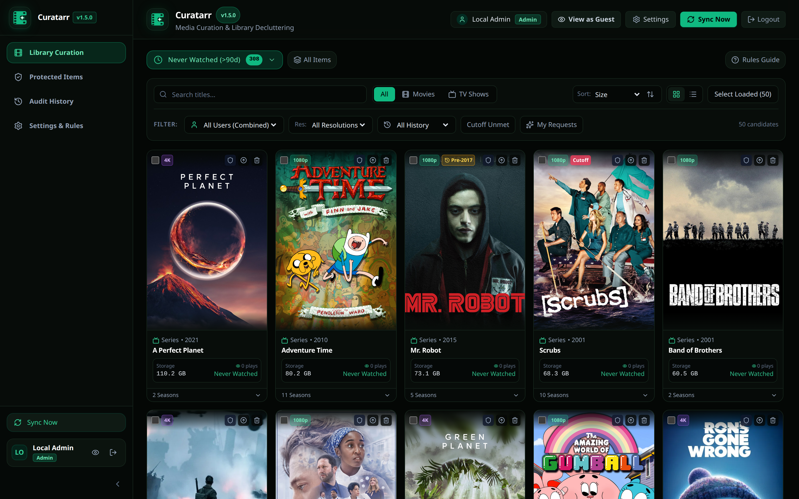
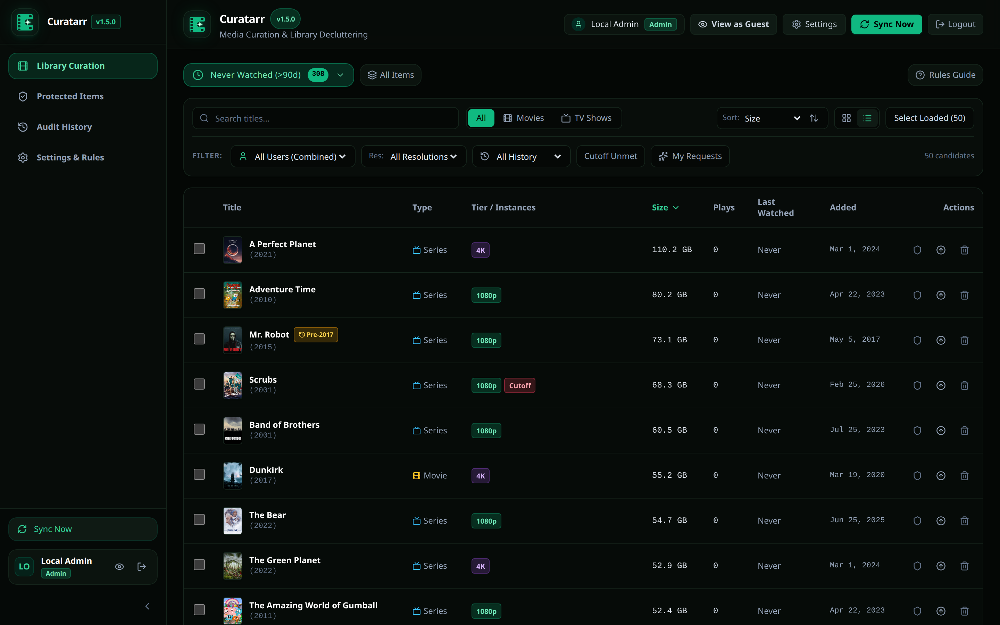
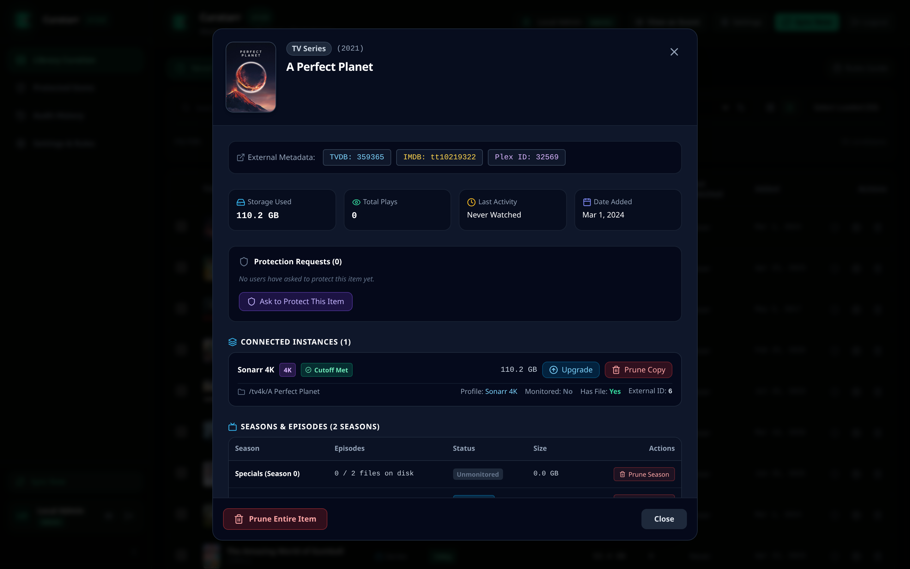
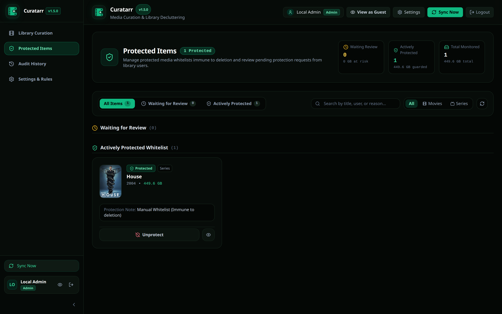
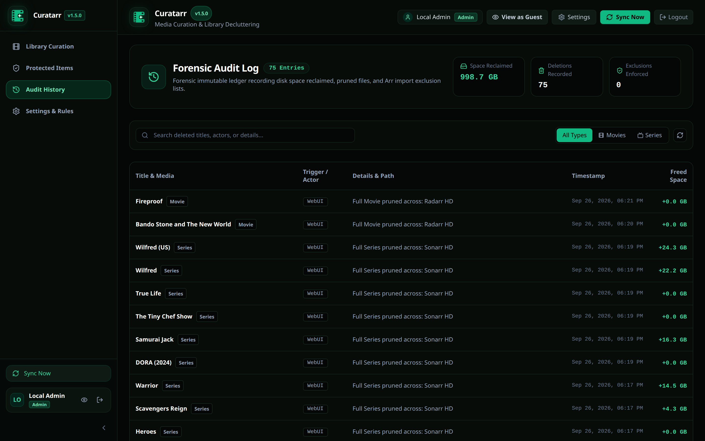
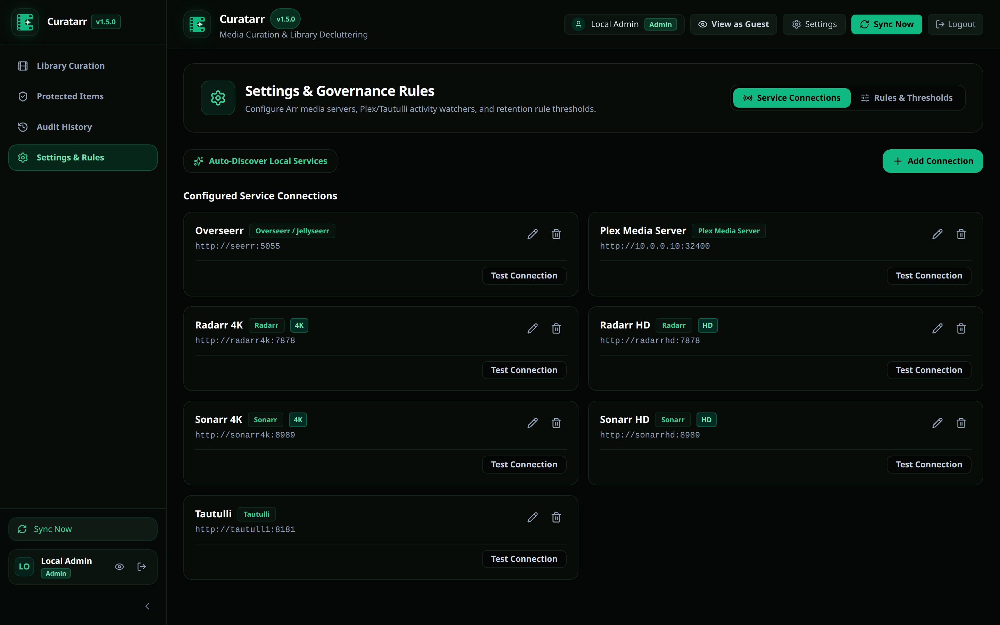

# Curatarr

Curatarr is a media curation and library cleanup system. It connects to Plex, Tautulli, Sonarr, Radarr, and Overseerr. It finds unwatched media, calculates disk usage, and helps users remove unwanted files safely.



---

## Table of Contents

- [Overview](#overview)
- [Key Features](#key-features)
- [User Interface Views](#user-interface-views)
- [Smart Categories](#smart-categories)
- [Architecture](#architecture)
- [Installation and Setup](#installation-and-setup)
- [Configuration](#configuration)
- [Model Context Protocol (MCP)](#model-context-protocol-mcp)
- [Development](#development)
- [License](#license)

---

## Overview

Self-hosted media servers collect large volumes of movies and television series. Over time, storage disks fill with unwatched or obsolete files. Curatarr collects metadata from media services and correlates watch records. It groups items into categories and gives administrators tools to delete items safely.

Curatarr protects against accidental data loss. It requires user confirmation for deletions, supports permanent whitelist protection, and logs every file removal.

---

## Key Features

### 1. Multi-Instance Media Server Support
Curatarr connects to multiple Sonarr and Radarr servers at the same time. You can manage separate instances for High Definition (HD), 4K Ultra-HD, and Anime libraries in one interface.

### 2. Overseerr-Style Plex Server & Admin Binding
When you first launch Curatarr, sign in with your Plex account to claim the primary administrator account. Curatarr queries Plex.tv for your owned and shared media servers, allowing you to select and bind your server with one click—no manual extraction of X-Plex-Tokens or machine identifiers needed.

### 3. Standalone Watch Activity Correlation
Curatarr works standalone with Plex Media Server and your Arr instances. Tautulli and Overseerr are completely optional companions. Without Tautulli, Curatarr uses Plex's native library watch records and play counts to drive all smart cleanup categories. When Tautulli is connected, it imports extended historical telemetry.

### 4. Dynamic Watch History Cutoff
Users start tracking watch history at different dates. Curatarr calculates the earliest recorded watch date for each user. If an item was added before tracking began and has zero plays, Curatarr adds a `Pre-YYYY` badge. This badge prevents the system from reporting old media as unplayed by mistake.

### 5. Smart Categories
The system groups media into automatic categories:
- **Never Watched**: Items in the library for more than 90 days with zero plays.
- **Stale (>365d)**: Items not watched during the previous 365 days.
- **Abandoned TV**: Television series with no activity for more than 365 days.
- **Sub-720p**: Older low-resolution media files.
- **Cutoff Unmet**: Media where the current file does not meet the Arr quality profile cutoff.
- **Space Hogs**: The largest media items on disk.
- **Missing / Stalled**: Monitored items that have no files on disk.

### 6. Granular Deletion Controls
When you remove media, you can select exact targets:
- Delete an entire movie across all instances.
- Delete a movie from one specific instance (for example, remove 4K but keep HD).
- Delete an entire television series.
- Delete specific television seasons while keeping newer episodes.

### 7. Whitelist Protection and Guest Requests
Administrators can protect items from deletion. Protected items display a green shield badge and cannot be pruned. Guest users can browse the library and submit protection requests with written reasons. Administrators review, approve, or dismiss these requests.

### 8. In-App Quality Profile Upgrades
You can trigger quality upgrades directly inside Curatarr. The system contacts Sonarr or Radarr to search for better releases and replace low-quality files.

### 9. Overseerr and Jellyseerr Integration
Curatarr links to Overseerr or Jellyseerr. You can filter the library by the user who requested the item. This feature allows administrators to contact requesters before deleting items.

### 10. Import Exclusion Automation
When you delete an item, you can add it to the Arr import exclusion list. This step stops Sonarr and Radarr from downloading the deleted item again.

### 11. Forensic Audit Log
Curatarr records all deletion actions in an SQLite audit ledger. The log includes the media title, affected Arr instances, exact disk paths, reclaimed bytes, timestamps, and the user name of the actor.

### 12. Model Context Protocol (MCP) Server
Curatarr includes an embedded MCP server (`/mcp/sse` and `/mcp/messages`). Autonomous AI coding assistants can query library statistics, list candidate items for pruning, and execute safe deletions through standard MCP tools.

---

## User Interface Views

### Poster Grid View
The grid view displays media cards with posters, resolution tags, storage usage, and play counters.


### Compact Table View
The table view shows dense information for bulk management. It displays paths, instances, sizes, last played dates, and batch selection checkboxes.



### Media Detail Modal
Click any item to inspect metadata, Plex identifiers, season lists, and the full per-user watch history table.



### Protected Items Page
The protected items view manages the whitelist of retained media and displays pending user protection requests.



### Forensic Audit History
The audit page displays all file deletions and calculates total reclaimed disk space.



### Settings & Configuration Tabs
The settings interface is organized into four purpose-built tabs:
- **Plex & Auth**: Displays active Plex server binding status, machine identifier, connection test, re-scan discovery, and Plex authentication enforcement.
- **Arr Connections**: Manage multiple Sonarr and Radarr instances with individual quality tiers (HD, 4K, Anime), connection tests, and one-click Docker service discovery.
- **Rules & Thresholds**: Configure age cutoffs, inactivity limits, and default deletion policies for smart categories.
- **Users**: Manage Plex users, assign `Admin` or `Guest` permissions, and remove inactive accounts.



---

## Smart Categories

| Category | Default Criteria | Purpose |
| :--- | :--- | :--- |
| **Never Watched** | Age > 90 days, Total Plays = 0 | Reclaim space from media that was never viewed. |
| **Stale** | Days Since Last Watch > 365 days | Identify forgotten media that users do not re-watch. |
| **Abandoned TV** | TV Series, Days Since Last Watch > 365 days | Prune old seasons of stopped television shows. |
| **Sub-720p** | Year >= 2000, Resolution < 720p | Find low-quality files to replace or remove. |
| **Cutoff Unmet** | Quality Cutoff Unmet in Arr | Find files ready for automated quality profile upgrades. |
| **Space Hogs** | Sorted by Total Disk Usage (Descending) | Free large amounts of disk space quickly. |
| **Missing** | Monitored = True, File On Disk = False | Clean up database entries with missing files. |

---

## Architecture

Curatarr uses a modern two-tier architecture:

```
┌────────────────────────────────────────────────────────┐
│                   React 19 Frontend                    │
│   (Vite, TypeScript Strict Mode, Tailwind CSS, Zustand)│
└───────────────────────────▲────────────────────────────┘
                            │ REST API / MCP (/mcp/sse)
┌───────────────────────────▼────────────────────────────┐
│                    .NET 10 API Server                  │
│       (ASP.NET Core Minimal APIs, Dapper, SQLite)      │
└──────────────┬──────────────────────────┬──────────────┘
               │                          │
        ┌──────▼──────┐            ┌──────▼──────┐
        │ Arr Servers │            │ Plex Server │
        │ Radarr (HD) │            │  Tautulli   │
        │ Radarr (4K) │            │  Overseerr  │
        │ Sonarr (HD) │            └─────────────┘
        │ Sonarr (4K) │
        └─────────────┘
```

- **Backend**: C# on .NET 10. Uses Dapper with SQLite in Write-Ahead Logging (WAL) mode for fast queries.
- **Frontend**: React 19 and TypeScript in strict mode. Uses Zustand for state management and Tailwind CSS with obsidian/emerald theme tokens.
- **Container**: Minimal Alpine Linux container image with immutable runtime layers.

---

## Installation and Setup

### Prerequisites
- Docker and Docker Compose installed on Linux, macOS, or Windows.
- Network access to your media server instances.

### Run with Docker Compose

1. Create a directory for Curatarr:
   ```bash
   mkdir -p /containers/curatarr/data
   cd /containers/curatarr
   ```

2. Create a `docker-compose.yaml` file:
   ```yaml
   services:
     curatarr:
       image: ghcr.io/spelech/curatarr:latest
       container_name: curatarr
       ports:
         - "8909:8080"
       volumes:
         - ./data:/app/data
       environment:
         - TZ=America/Chicago
       restart: unless-stopped
   ```

3. Start the container:
   ```bash
   docker compose up -d
   ```

4. Open your web browser and go to:
   ```
   http://localhost:8909
   ```

---

## Configuration

1. **Sign In & Claim Admin**: On first visit, sign in with your Plex account. The first registered user automatically becomes the primary Curatarr administrator.
2. **Plex Server Binding**: An Overseerr-style setup modal will appear. Curatarr queries Plex.tv for your servers. Select your media server from the dropdown, verify the local connection URL, and click **Bind & Save**.
3. **Configure Arr Instances**: In **Settings** -> **Arr Connections**, add your Radarr and Sonarr servers (or click **Auto-Discover Local Services** if running on the same Docker network).
4. **Optional Companions**:
   - Curatarr operates standalone with Plex native library play counts.
   - If you use **Tautulli**, add it under **Arr Connections** for extended historical telemetry.
   - If you use **Overseerr** or **Jellyseerr**, add it to map requester identities to library items.
5. **Initial Sync**: Click **Sync Now** in the top navigation bar to populate your catalog and calculate smart categories.

---

## Model Context Protocol (MCP)

Curatarr embeds an MCP server for AI agent integrations.

- **SSE Endpoint**: `http://localhost:8909/mcp/sse`
- **Messages Endpoint**: `http://localhost:8909/mcp/messages`

### Claude Desktop Configuration
Add the following configuration to `claude_desktop_config.json`:

```json
{
  "mcpServers": {
    "curatarr": {
      "command": "npx",
      "args": [
        "-y",
        "mcp-proxy",
        "http://localhost:8909/mcp/sse"
      ]
    }
  }
}
```

### Available MCP Tools
- `get_library_stats`: Returns total titles, total file size, and space reclaimed.
- `list_pruning_candidates`: Lists items for a category (for example, `never_watched` or `stale`).
- `get_item_details`: Returns complete metadata, paths, and watch counts for an item.
- `execute_prune`: Deletes an approved item or season and records the action in the audit log.

---

## Development

### Backend (.NET 10)
```bash
# Build the solution
dotnet build curatarr.slnx

# Run automated tests
dotnet test tests/Curatarr.Tests/Curatarr.Tests.csproj
```

### Frontend (React 19)
```bash
cd src/Curatarr.Web

# Install dependencies
npm install

# Run unit tests
npm test

# Run linter
npx eslint . --max-warnings 0

# Start local Vite development server
npm run dev
```

### Build Docker Image
```bash
docker build -t ghcr.io/spelech/curatarr:latest .
```

---

## License

This project is licensed under the MIT License. See [LICENSE](LICENSE) for details.
